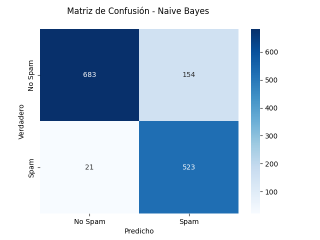
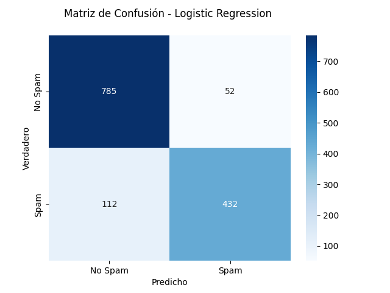

# Detector de spam

## 1. ¿Cuáles son las 10 palabras más encontradas en correos con SPAM y en correos No SPAM? ¿Hay palabras en común? ¿Algunas llaman la atención?

### SPAM

Las 10 palabras más encontradas en correos con SPAM son:

| Orden | Palabra  | Frecuencia |
| ----- | -------- | ---------- |
| 1     | you      | 4105599    |
| 2     | your     | 2502597    |
| 3     | will     | 997100     |
| 4     | free     | 939790     |
| 5     | our      | 931799     |
| 6     | all      | 732080     |
| 7     | mail     | 635470     |
| 8     | email    | 578759     |
| 9     | business | 521250     |
| 10    | remove   | 499309     |

### No SPAM

Las 10 palabras más encontradas en correos No SPAM son:

| Orden | Palabra | Frecuencia |
| ----- | ------- | ---------- |
| 1     | you     | 3541702    |
| 2     | george  | 3527559    |
| 3     | hp      | 2496576    |
| 4     | will    | 1495268    |
| 5     | your    | 1223098    |
| 6     | hpl     | 1204398    |
| 7     | re      | 1159138    |
| 8     | edu     | 800669     |
| 9     | address | 681569     |
| 10    | meeting | 604460     |

### Palabras en común y llamativas
Las palabras comunes entre los correos con SPAM y los correos No SPAM son: `you`, 'your', 'will', nótese que estas palabras que podrían ser comunes en cualquier tipo de texto, dado que son pronombres y verbos comunes en inglés. 

En cuanto a palabras llamativas, destacan palabras como 'free', 'business' y 'remove' en los correos con SPAM, dado que son palabras que podrían asociarse a ofertas, publicidad, estafas, etc. También resulta interesante ver un nombre propio como 'george' en los correos No SPAM, lo cual podría deberse a que es un nombre común en la base de datos de correos No SPAM, por otro lado, 'edu', 'address', 'meeting' podrían ser palabras comunes en correos institucionales o de trabajo.

## 2. Separe el conjunto de datos en un conjunto de entrenamiento y un conjunto de prueba (70% y 30% respectivamente).
El desarrollo de esta pregunta se encuentra en el notebook [spam_detector_notebook.ipynb](spam_detector_notebook.ipynb). Realizando la separación de los datos en un conjunto de entrenamiento y un conjunto de prueba, se obtuvo que el conjunto de entrenamiento tiene 3220 muestras y el conjunto de prueba tiene 1381 muestras.

## 3. Utilizando un clasificador de Bayes ingenuo, entrene con el conjunto de entrenamiento.
El desarrollo de esta pregunta se encuentra en el notebook [spam_detector_notebook.ipynb](spam_detector_notebook.ipynb). Se entrenó un clasificador Multinomial Naive Bayes y se obtuvo un accuracy de 0.8633 con el conjunto de entrenamiento y un accuracy de 0.8733 con el conjunto de prueba.

## 4. Utilizando un clasificador de Regresión Logística, entrene con el conjunto de entrenamiento (en este caso, normalice los datos).
El desarrollo de esta pregunta se encuentra en el notebook [spam_detector_notebook.ipynb](spam_detector_notebook.ipynb). Se entrenó un clasificador de Regresión Logística con los datos normalizados y se obtuvo un accuracy de 0.8071 con el conjunto de entrenamiento y un accuracy de 0.8067 con el conjunto de prueba.

## 5. ¿Qué modelo escogería para detectar SPAM? ¿Por qué?
### Modelo: Clasificador Naive Bayes
Los valores obtenidos de la matriz de confusión para el clasificador Naive Bayes son:

Esto se interpreta de la siguiente manera:

- **Verdaderos positivos (TP):** 523 correos fueron correctamente clasificados como spam.
- **Verdaderos negativos (TN):** 683 correos fueron correctamente clasificados como no spam.
- **Falsos positivos (FP):** 154 correos no spam fueron incorrectamente clasificados como spam.
- **Falsos negativos (FN):** 21 correos spam fueron incorrectamente clasificados como no spam.

El clasificador Naive Bayes cometió más errores del tipo Falsos Positivos (154) que del tipo Falsos Negativos (21), lo cual indica que el modelo es más propenso a clasificar correos no spam como spam, que a clasificar correos spam como no spam. Esto puede resultar beneficioso en el contexto de un filtro de spam, ya que es preferible que un correo no spam sea tomado como spam, a que un correo spam no sea filtrado y pase a la bandeja de entrada del usuario.

### Modelo: Clasificador de Regresión Logística

Los valores obtenidos de la matriz de confusión para el clasificador de Regresión Logística son:

Esto se interpreta de la siguiente manera:

- **Verdaderos positivos (TP):** 432 correos fueron correctamente clasificados como spam.
- **Verdaderos negativos (TN):** 785 correos fueron correctamente clasificados como no spam.
- **Falsos positivos (FP):** 52 correos no spam fueron incorrectamente clasificados como spam.
- **Falsos negativos (FN):** 112 correos spam fueron incorrectamente clasificados como no spam.

El clasificador de Regresión Logística cometió más errores del tipo Falsos Negativos (112) que del tipo Falsos Positivos (52), lo cual indica que el modelo es más propenso a clasificar correos spam como no spam, que a clasificar correos no spam como spam. De forma contraria al clasificador Naive Bayes, el clasificador de Regresión Logística es más propenso a dejar pasar correos spam a la bandeja de entrada del usuario, lo cual no es deseable en un filtro de spam.

### Conclusión
Dado que el clasificador Naive Bayes es más propenso a clasificar correos no spam como spam, y es menos propenso a dejar pasar correos spam a la bandeja de entrada del usuario, se escogería este modelo para detectar SPAM. Sin embargo, es importante mencionar que el caso ideal sería un modelo que minimice tanto los Falsos Positivos como los Falsos Negativos, aunque pueda ser más complicado de lograr.

## Calcule la precisión y la recuperación de ambos modelos. Para cada métrica, ¿cuál es el mejor modelo? ¿Cómo se relacionan estas métricas con los tipos de errores analizados en el punto anterior? Expanda su respuesta.

### Modelo: Clasificador Naive Bayes
Se obtuvieron los siguientes valores de precisión y recuperación para el clasificador Naive Bayes:

| Métrica      | Valor  |
|--------------|--------|
| Precisión    | 0.7727 |
| Recuperación | 0.9617 |

### Modelo: Clasificador de Regresión Logística
Se obtuvieron los siguientes valores de precisión y recuperación para el clasificador de Regresión Logística:

| Métrica      | Valor     |
|--------------|-----------|
| Precisión    | 0.8926    |
| Recuperación | 0.7941    |

### Mejor modelo
La precisión mide la proporción de correos clasificados como spam que realmente son spam, mientras que la recuperación mide la proporción de correos spam que fueron correctamente clasificados como spam. Para la precisión, el mejor modelo es el clasificador de Regresión Logística, ya que tiene un valor de 0.8926, mientras que el clasificador Naive Bayes tiene un valor de 0.7727. Para la recuperación, el mejor modelo es el clasificador Naive Bayes, ya que tiene un valor de 0.9617, mientras que el clasificador de Regresión Logística tiene un valor de 0.7941.

### Relación con los tipos de errores del punto anterior
La precisión y la recuperación están relacionadas con los tipos de errores analizados en el punto anterior de la siguiente manera:

- **Precisión:** La precisión se ve afectada por los Falsos Positivos, ya que mide la proporción de correos clasificados como spam que realmente son spam. En el caso del clasificador Naive Bayes, que tiene más Falsos Positivos que el clasificador de Regresión Logística, la precisión es menor.

- **Recuperación:** La recuperación se ve afectada por los Falsos Negativos, ya que mide la proporción de correos spam que fueron correctamente clasificados como spam. En el caso del clasificador Naive Bayes, que tiene menos Falsos Negativos que el clasificador de Regresión Logística, la recuperación es mayor.

En el contexto de un filtro de spam, considero que la recuperación es una métrica importante, ya que se busca minimizar la cantidad de correos spam que pasan a la bandeja de entrada del usuario. Por lo tanto, el clasificador Naive Bayes sería el mejor modelo para detectar SPAM, ya que tiene una mayor recuperación que el clasificador de Regresión Logística. Sin embargo, es importante tener en cuenta que la precisión también es una métrica relevante, ya que se busca que la mayoría de los correos clasificados como spam realmente sean spam, por lo que el clasificador de Regresión Logística también es una buena opción, sin embargo, ya que el clasificador Naive Bayes tiene una precisión aceptable, mantendría mi elección por este modelo.
